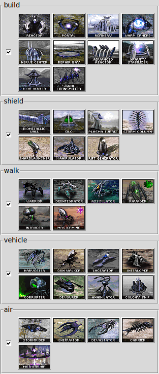

OpenRA tree and keyboards

This is a collection of hardware/doc. 
helpers for [OpenRA game](https://www.openra.net/) ([GitHub](https://github.com/OpenRA/OpenRA)):

1. standard keyboard tuning (e.g. printed stickers [Fn keys](drawing.pdf))
1. built touch screen (i.e. RaspBerryPi as HID)
1. faction trees (presently *scrin*, only) as a [graph](graph.pdf)

note: early development of `KEYSS`, current faction available is *scrin*, only (work in progress).

<!--- begin@of@TOC --->
# Table of contents

1. [Keys Screen](#keys-screen)
1. [tree](#tree)
     1. [build tree](#build-tree)
          1. [misc.](#misc)
1. [keyboard](#keyboard)
     1. [keys](#keys)
          1. [tabs](#tabs)
          1.1. [design](#design)
          1. [modes](#modes)
          1.1. [design](#design)
          1. [Fn](#fn)
     1. [Fn key map](#fn-key-map)
1. [misc.](#misc)
<!--- end@of@TOC --->

# Keys Screen

`Keyss` is a GUI on touch screen for playing game
, i.e. acts as a keyboard for the game computer.

~~~ { .bash }
./keyss.py --tree-path $PWD/trees/CA/scrin/repear17/
~~~

For example, touch *reactor* image in **build** section to build a *reactor* 
in [OpenRA/CA](https://github.com/Inq8/CAmod) !
`Keyss` is sending `E+F1` keys for *reactor* building for your *scrin* faction.

# tree

## build tree

~~~ { .bash }
dot -Tps graph.dot > graph.ps
evince graph.ps &
~~~

### misc.

dot content

~~~ { .bash }
./FtoG.sh
~~~

# keyboard

## keys

### tabs

~~~ { .bash }
sudo ./ptouch-print --image /media/xubuntu/tempo/LinuxTV/OpenRA/Keyb/12mm_tabs.png
~~~

#### design

~~~ { .bash }
gimp 12mm_tabs.xcf &
#gimp tab_*.png
~~~

### modes

~~~ { .bash }
sudo ./ptouch-print --image /media/xubuntu/tempo/LinuxTV/OpenRA/Keyb/12mm_modes.png
~~~

#### design

~~~ { .bash }
gimp 12mm_modes.xcf &
#gimp mode_*.png
~~~

### Fn

arrows

## Fn key map

# misc.

~~~ { .bash }
./CombinedArms-0.82-x86_64.AppImage --appimage-mount

d=/tmp/.mount_Combinn5q6Tc
ls $d/usr/lib/openra/mods/ca/uibits/

ristretto $d/usr/lib/openra/mods/ca/uibits/*

#images (PNG)
ristretto `find $d | grep '.png'`

cp -p $d/usr/lib/openra/mods/ca/uibits/glyphs*.png images/
cp -p $d/usr/lib/openra/mods/ca/icon*.png images/
cp -p $d/usr/share/icons/hicolor/64x64/apps/openra-ca.png images/

#openra-ca-utility
./CombinedArms-0.82-x86_64.AppImage --utility

./CombinedArms-0.82-x86_64.AppImage --utility --weapon-docs > weapon-docs.md
./CombinedArms-0.82-x86_64.AppImage --utility --docs > docs.md
 
 
./CombinedArms-0.82-x86_64.AppImage --utility --extract temperat.pal
./CombinedArms-0.82-x86_64.AppImage --utility --extract ttnk2icon.shp

./CombinedArms-0.82-x86_64.AppImage --utility --png ttnkicon.shp temperat.pal

#keyboard
gimp tabs.xcf images/glyphs-2x.png &
inkscape drawing.svg &
#print to file "drawing.pdf"
~~~

